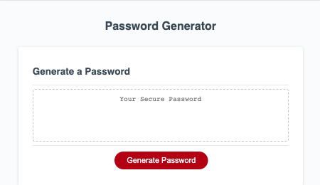
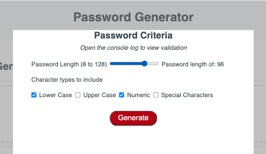
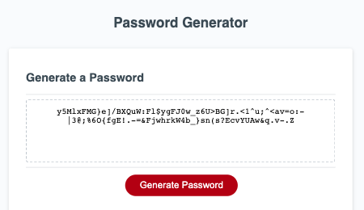

# Password-Generator
This repository contains the code for the Password Generator (Module 3). It is prompts a user to select a criteria for a password and then, based on the criteria, creates a random password. 

## Description
This repository provides the code for the Github Pages app for generating random passwords based on user selected criteria. This is a parametric password generation based on criteria determined by the user. Please view thru Github Pages. 

Github Repository: [PasswordGenerator](https://github.com/rbarbosa51/Password-Generator)

Github Pages: [Password Generator](https://rbarbosa51.github.io/Password-Generator/)

## Screen Shots
Initial

Popup 

Generated Password

## Table of Contents

- [Installation](#installation)
- [Usage](#usage)
- [Credits](#credits)
- [License](#license)
- [ThoughtProcess](#thought-process)
- [StudentNotes](#notes)

## Installation

It is meant to be viewed from Github Pages. No installation requirements.

## Usage
Click on the Generate Password button to open the popup. From there select the criteria that would best suit your password requirements

## Credits and References

Rafael Barbosa

CSS Popup  _This was the main inspiration. However, had to make many changes_
Youtube -The Net Ninja	CSS Tips & Tricks #5	https://www.youtube.com/watch?v=6Xfkr9n3LSA

Input Range
MDN webdocs	https://developer.mozilla.org/en-US/docs/Web/HTML/Element/input/range

Input Types
W3Schools		https://www.w3schools.com/html/html_form_input_types.asp

Checkbox checked
W3Schools		https://www.w3schools.com/jsref/prop_checkbox_checked.asp

Array to strings
https://sebhastian.com/javascript-array-string/

## License

MIT License

---- 

